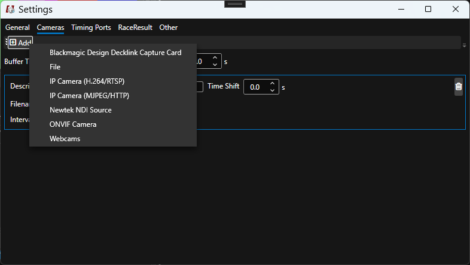

# Cameras

## Overview

IDCamPro can connect to one or more cameras or image sources at the same time. Supported sources are: 

* Axis or Hikvision camera, using either H.264 streams or MJPEG (the later is recommended as usually image qualitiy for stills is better but there is more network load))
* Local webcams (USB or laptop)
* HDMI or SDI via Blackmagic Design Decklink devices
* NDI sources 

## Global Settings

| Key                | Explanation |
| -        | ----- | 
| Buffer Time | Frames will be stored in a buffer for this given amount of time. Triggers or passings are always received a little delayed, therefore then a recording is triggered frames from the buffer will also be recorded to allow more frames before the event |
| Manual Recording Duration | When pressing `F8` a trigger is simulated. The time of the recording is defined with this value  |

## Per-Camera Settings

| Key                | Explanation |
| -        | ----- | 
| Time Shift     | Frames from cameras are most likely a little delayed, also your computer time may not be well synchronized. In order to shift frames and finish crossings better to the matching trigger or passing, you can play around with the time shift. This way the image's received timestamp is shifted accordingly |