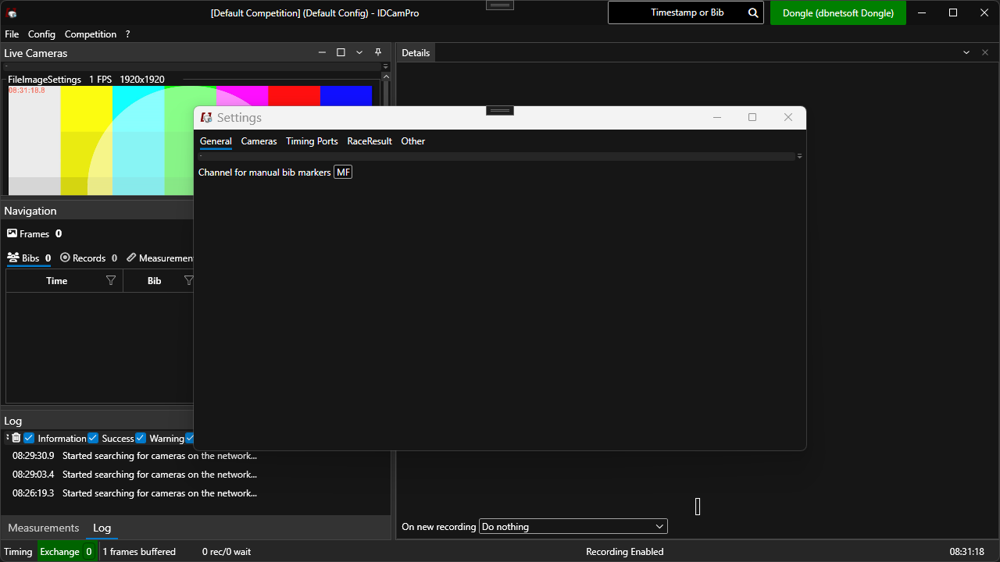

# Configuration

## Overview

IDCamPro allows you to create "configs" by going to the `Config`-menu and either create a new one or load an existing one. Each config stores configurations for e.g. timing devices and cameras and chip files. This allows to build presets for various types of events.

Settings for a loaded config can be changed by going to `Config` - `Settings` menu item:

