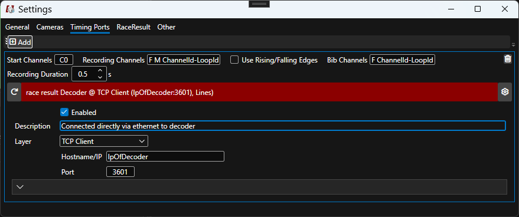

# Timing Devices

## Race Result

The following devices are supported:

* System 5000 directly via local network (port 3601)
* Exporter setup on local webserver in RR12

## Configuration

ALGE-Timing channels are from C0 to C9, usually being C0 the start and C1 the finish.
The meaning of each setting is described [here](index.md).

### Active

As there can be many remote devices and/or loops connected to a decoder or RR12 event file, differentiation is based on channel and loop IDs. 

| Key                | Values | Example |
| -        | ----- | ------- |
| Start Channels     | `M<channelId>-<loopId>` | `M3-1`  for loop 1 on channel 3 |
| Recording Channels | `<channelId>-<loopId>` | `2-1`  for loop 1 on channel 2 |
| Bib Channels | `<channelId>-<loopId>` | `5-1`  for loop 1 on channel 5 |

### Passive

| Key                | Values | Default |
| -        | ----- | ------- |
| Start Channels     | `M` | `M` |
| Recording Channels | `M`, `F` | `M F`  for recording on both a trigger and a passing |
| Bib Channels | `F` | `F` |

`M`stands for manual input on the active extension by either a lightbeam or a push button.

Rising/falling edge cannot be used.

