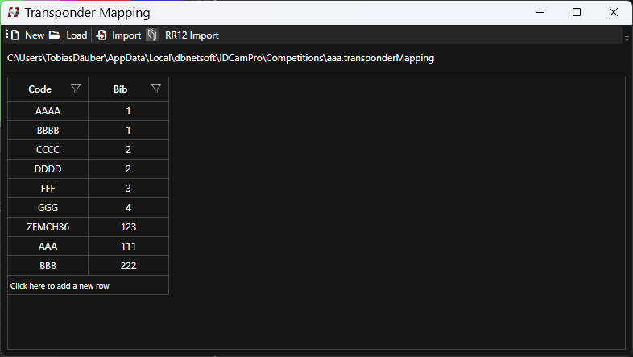

# Transponder Mapping / Chip File

## Overview

IDCamPro stores transponder mapping in it's own file format/extension .transponderMapping. A config hold's a reference to this particular file. Best is if you keep this in the same directory as your config file.

!!! info

    If you import a mapping from an Excel or CSV file and no mapping has ever been created, IDCam Pro will not only ask you for the source mapping file (Excel or CSV), but also asks you where to store the .transponderMapping file. The same is true if you first import from RR12 and no .transponderMapping file has ever been created. 

Transponder mappings can be imported in either of the following ways: 

* Manually typed in the transponder mapping window
* Import form XLS/XLSX or CSV file - first column is code, second is bib
* Directly from RR12 (from both chip file and transponder 1 and 2 from participants)

