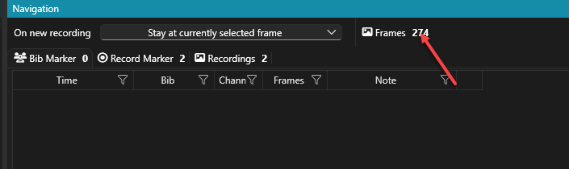

# Release Notes

#### 1.0.35 @ 2024-03-21

*   Fixed: Matching record and bib markers are not consuming all of the available vertical screen space anymore but is limited to max. two rows and area is scrollable\

    <figure><figcaption></figcaption></figure>
* Added: Time Shift for adjusting passing to finish line image is now conveniently available on the live camera image when hovering over it with the mouse
* Fixed: No more crash when software was closed while Details Window was still open
* Fixed: When using the Details Window, when navigating around sometimes one of the details views showed a white dot instead of the actual image\
